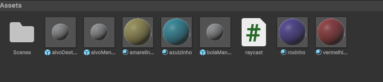
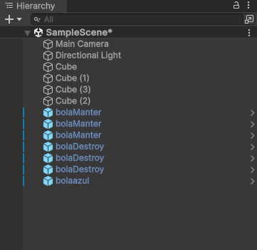

# Raycast_2024
Conceitos de Raycast, Prefabs e Destroy no Unity

    void Update()
    {
        if (Input.GetMouseButtonDown(0))
        
            { 
            // Quando o botão esquerdo é clicado ele vai verificar um hit do raycast
            Ray ray = GetComponent<Camera>().ScreenPointToRay(Input.mousePosition);
            RaycastHit hit;
            if (Physics.Raycast(ray, out hit))
            {
                // Quando for clicado, irá verificar primeiro a tag do gameObject
                string tag = hit.collider.tag;
                GameObject volinho = hit.transform.gameObject;
                // o gameObject foi clicacado e irá fazer uma ação de acordo com a tag especifica
                if (tag == "destroy")
                {
                    Debug.Log("Acertou!");
                    Destroy(bolinho);
                } 
                // Não acertou o gameObject
                else
                {
                    Debug.Log("Errou");
                }
            }
        }
    }
    

 O Script está na camera, aonde vai ocorrer a interação com os gameObjects 

<h2> Tela do Jogo</h2>

<h2> Prefabs </h2>

<h2> Hierarquia </h2>

